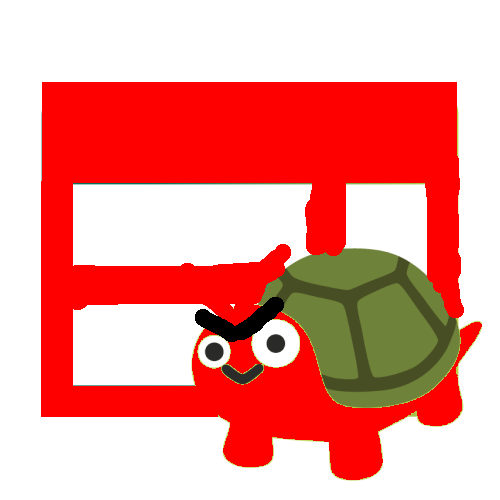

<div align="center">


<h1 align="center">EvilBrowse</h1>

<p align="center">
A polished, private, local-first Chromium desktop browser with <b>vertical tabs</b>, built-in <b>uBlock-Origin filter blocking</b>, and <b>opt-in local AI</b> — stabilized from Turtlebrowse.
</p>
<p><a href="/CHANGELOG.md">Changelog</a> • <a href="/LICENSE">License</a> • Forked from <a href="https://github.com/ingStudiosOfficial/turtlebrowse">ingStudiosOfficial/turtlebrowse</a></p>
<hr />
</div>

> **Why "Evil"?** The name is playful: the browser is "evil" because it fights bugs and refuses to behave badly. It is a legitimate web browser, not malware.

## Features

- **No OS titlebar** — Firefox-style client-side decorations: tabs live in the title-bar row with built-in minimize / maximize / close, drag-to-move and double-click-to-maximize
- **Vertical tabs** with collapsible sidebar, plus optional classic **horizontal strip** (Settings → Appearance → Tab bar position)
- **uBlock Origin filter lists** (uAssets + EasyList + EasyPrivacy, ~160k rules) with live rule/blocked counters and manual refresh in Settings → Privacy
- **Fast cold startup** — AI, filter lists, and history writes all initialize off the UI threads; AI never starts unless enabled
- **Opt-in local agentic AI** via Ollama (Settings → AI integrations), lazy-loaded on first use
- **Profiles** — multiple isolated user profiles, guest mode, profile picker
- **Discord Rich Presence** with configurable app ID so the displayed game name is yours
- **Extras** — yt-dlp video downloads, integrated terminal, zoom/find sidebars, Chrome DevTools
- **Private by default** — no telemetry; browsing data stays on disk under your profile only

## Keyboard shortcuts

| Shortcut | Action |
|---|---|
| `Ctrl + T` | New tab |
| `Ctrl + W` | Close current tab |
| `Ctrl + Shift + T` | Reopen closed tab |
| `Ctrl + Tab` / `Ctrl + Shift + Tab` | Next / previous tab |
| `Ctrl + 1…8` / `Ctrl + 9` | Jump to tab N / last tab |
| `Ctrl + L` | Focus address bar |
| `Ctrl + R` / `Ctrl + Shift + R` | Reload / hard reload |
| `Ctrl + F` | Find in page |
| `Ctrl + H` | History |
| `Ctrl + B` / `Ctrl + M` | AI sidebar / browser menu |
| `Ctrl + Shift + I` or `F12` | DevTools |
| `Alt + ←` / `Alt + →` | Back / forward |
| `F11` | Fullscreen |
| `Ctrl + Q` | Quit |

## Download

EvilBrowse packages are built from this repo with Gradle `jpackage` (see `app/build.gradle.kts`). The upstream Turtlebrowse downloads live at [turtlebrowse.ingstudios.dev](https://turtlebrowse.ingstudios.dev).

## Development

EvilBrowse is a stabilization fork of Turtlebrowse and welcomes contributions. We welcome any sort of contributions that are **human made**. Here's how to build EvilBrowse.

### Prerequisites

- **Git** - Source control for EvilBrowse

- **JDK 25** - EvilBrowse is powered by Java 25 and uses the latest features

- **Node.js** - Used to build the internal pages and website

### Building and Running

#### Browser

1. **Clone the repository**
```bash
git clone https://github.com/whyfle/evilbrowse.git
cd evilbrowse
```

2. **Build the Gradle project**
```bash
# Relative to the root of the project
cd app
./gradlew build # or ./gradlew.bat build on Windows
```

3. **Run the Gradle project**
```bash
./gradlew run # or ./gradlew.bat run on Windows
```

#### Internal Pages

1. **Install dependencies**
```bash
# Relative to the root of the project
cd frontend/pages
npm install
```

2. **Run the pages in development mode**
```bash
npm run dev
```

3. **Build the pages**
```bash
npm run build
```

#### Internal Games

##### Dino

1. **Install dependencies**
```bash
# Relative to the root of the project
cd frontend/games/dino
npm install
```

2. **Run the dino game in development mode**
```bash
npm run dev
```

3. **Build the dino game**
```bash
npm run build
```

#### Website

1. **Install dependencies**
```bash
# Relative to the root of the project
cd website
npm install
```

2. **Run the website in development mode**
```bash
npm run dev
```

3. **Build the website**
```bash
npm run build
```

### Updates proxy

1. **Run the Go project**
```bash
# Relative to the root of the project
cd updates
go run .
```

2. **Build the binary**
```bash
go build -o ./build/evilbrowseupdates .
```

## Credits

Huge thank you to the [Java Chromium Embedded Framework](https://github.com/chromiumembedded/java-cef) project for providing Java bindings to CEF, [jcefmaven](https://github.com/jcefmaven/jcefmaven) for providing pre-built binaries for Gradle, and [ingStudiosOfficial/turtlebrowse](https://github.com/ingStudiosOfficial/turtlebrowse) for the upstream codebase this fork stabilizes. This project would not have been possible without them.

**Notable mentions**

- [wayou/t-rex-runner](https://github.com/wayou/t-rex-runner) for decompiling the Chromium Dino game from the [Chromium](https://github.com/chromium/chromium) source code (I tried doing it myself but it was a pain, huge thanks!)
- [JetBrains/jediterm](https://github.com/JetBrains/jediterm) for providing integrated terminal support
- [sshahine/JFoenix](https://github.com/sshahine/JFoenix) for beautiful Material 3 JavaFX components
- [ollama4j/ollama4j](https://github.com/ollama4j/ollama4j) for the Java API wrapper for Ollama

The other dependencies that can be found in [build.gradle.kts](app/build.gradle.kts) are also very much appreciated!

## License

EvilBrowse is licensed under the Apache 2.0 License. Check [LICENSE](./LICENSE) for more details.
